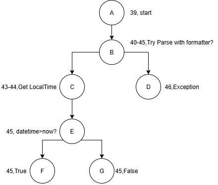

# Project Phase 1 Report

## 1. Plan Purpose

### Purpose

Ensure that the command line can correctly parse dates and times,  
including both syntax and semantic checks.

### Scope

At this stage, SQA mainly focuses on the `DateTimeChecker` class.

---

## 2. Type

| Item                  | Grammar                                  |
| --------------------- | ---------------------------------------- |
| **Date (YYYY-MM-DD)** | digits only (`0`–`9`, excluding hyphens) |
| Semantics             | valid Gregorian date                     |
|                       | must be ≥ today                          |
|                       | must be ≤ 100 days ahead                 |
| **Time (THH:MM)**     | digits only (`0`–`9`, excluding colons)  |
| Semantics             | valid 24-hour clock                      |

## 3. Control Flow and Test Paths

### 3.1 isValidDate

| Test Type         | Scenario                | Path              | Result |
| ----------------- | ----------------------- | ----------------- | ------ |
| Basic path        | Illegal date            | A → B → D         | false  |
|                   | Valid date & in range   | A → B → C → E → F | true   |
|                   | Valid date & not in rng | A → B → C → E → G | false  |
| Boundary analysis | date = today            | A → B → C → E → F | true   |
|                   | date = today+100        | A → B → C → E → F | true   |
|                   | date = today+101        | A → B → C → E → G | false  |
|                   | date < today            | A → B → C → E → G | false  |

---

### 3.2 isValidDateTime

| Test Type         | Scenario                   | Path              | Result |
| ----------------- | -------------------------- | ----------------- | ------ |
| Basic path        | Invalid datetime format    | A → B → D         | false  |
|                   | Valid datetime & after now | A → B → C → E → F | true   |
|                   | Valid datetime ≤ now       | A → B → C → E → G | false  |
| Boundary analysis | datetime = now             | A → B → C → E → G | false  |
|                   | datetime = now + 1 min     | A → B → C → E → F | true   |
|                   | datetime = now - 1 min     | A → B → C → E → G | false  |
|                   | Invalid string             | A → B → D         | false  |

---

## 4. Workout

- GitHub repository
- `README.md`
- `CheckDateTimeStringTest.java`
- JUnit test cases
- Pull Requests
- Report

---

## 5. Standards

1. Follow Java coding standards and JUnit 5 specification.
2. GitHub PR workflow: use branches, require ≥ 2 reviewers,  
   merge only after approval.
3. Quality measures: maintainable code complexity; tests cover  
   normal, illegal, and boundary cases.

---

## 6. SQA Actions, Methods and Findings

### Developer — Nafisa Tabassum

#### Nafisa: Actions and Tasks

- Write `DateTimeChecker.java`

#### Nafisa: Methods and Tools

- Implement syntax and semantic verification
- Prohibit System.out/err, use logs instead
- Write Javadoc for public methods

---

### Developer — Erqian Chen

#### Erqian: Actions and Tasks

- Write JUnit test cases

#### Erqian: Methods and Tools

- Use JUnit 5
- Apply equivalence partitioning and boundary value analysis
- Use parameterized testing to reduce duplication

---

### Reviewer — Keming Cao, Ahmed Shadab

#### Reviewer: Actions and Tasks

- Review and merge pull requests

#### Reviewer: Methods and Tools

- Require PRs from feature branches
- Adopt Conventional Commits
- Resolve all review conversations before merging

---

### Reporter — Yanxi Liu

#### Reporter: Actions and Tasks

- Write and maintain the SQA plan

#### Reporter: Methods and Tools

- Keep the report in Markdown format
- Ensure the report passes lint and formatting checks

---

## 7. Evaluation

### Code Quality

- 100% PR merge rate after review.

### Test Quality

- Use parameterized tests to reduce duplication.

### Process Quality

- Each PR reviewed by ≥ 2 reviewers.

### Defect Tracking

- Use GitHub Issues with ≥ 90% closure rate for critical defects.

---

## 8. Risk Management

### Risk

If the system is deployed in different regions,  
time zone differences may cause booking confusion.

### Mitigation

Consider unifying the time zone source.
