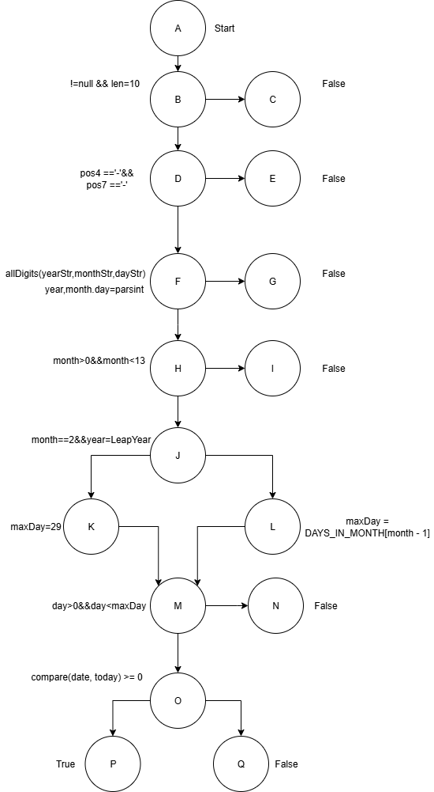

# Project Phase 1 Report

## 1. Plan Purpose

### Purpose

Ensure that the command line can correctly parse dates and times,  
including both syntax and semantic checks.

### Scope

At this stage, SQA mainly focuses on the `DateTimeChecker` class.

---

## 2. Type

| Item                  | Grammar                                  |
| --------------------- | ---------------------------------------- |
| **Date (YYYY-MM-DD)** | digits only (`0`–`9`, excluding hyphens) |
| Semantics             | valid Gregorian date                     |
|                       | must be ≥ today                          |
| **Time (THH:MM)**     | digits only (`0`–`9`, excluding colons)  |
| Semantics             | valid 24-hour clock                      |

We choose to record time up to **minutes (THH:MM)** because:

- **Business need**:

  Airline timetables and tickets are always published in minutes.

- **Practicality**:

  Seconds add no real value to passengers or staff but increase complexity.

---

## 3. Control Flow and Test Paths

### 3.1 isValidDate

| Test Type  | Scenario                    | Path                | Result |
| ---------- | --------------------------- | ------------------- | ------ |
| Basic path | Null or wrong length        | A→B→C               | false  |
|            | (not 10 chars)              |                     |        |
|            | Invalid format              | A→B→D→E             | false  |
|            | (wrong separators)          |                     |        |
|            | Non-digit in year/month/day | A→B→D→F→G           | false  |
|            | Month out of range          | A→B→D→F→H→I         | false  |
|            | (0 or 13)                   |                     |        |
|            | Day overflow                | A→B→D→F→H→J→L→M→N   | false  |
|            | (e.g., 2025-04-31)          |                     |        |
|            | Valid future date           | A→B→D→F→H→J→L→M→O→P | true   |
|            | (non-Feb)                   |                     |        |
| Boundary   | Date = today                | A→B→D→F→H→J→L→M→O→P | true   |
|            | (boundary on compare)       |                     |        |
|            | Date < today                | A→B→D→F→H→J→L→M→O→Q | false  |
|            | (just before boundary)      |                     |        |
|            | Leap day valid              | A→B→D→F→H→J→K→M→O→P | true   |
|            | (2024-02-29)                |                     |        |
|            | Leap day invalid            | A→B→D→F→H→J→L→M→N   | false  |
|            | (2025-02-29)                |                     |        |

---

### 3.2 isValidDateTime

| Test Type  | Scenario                   | Path              | Result |
| ---------- | -------------------------- | ----------------- | ------ |
| Basic path | Null or wrong length       | A→B→C             | false  |
|            | (not 19 chars)             |                   |        |
|            | Wrong separators           | A→B→D→E           | false  |
|            | (e.g., `2025/09/03T12:00`) |                   |        |
|            | Invalid date part          | A→B→D→F→G         | false  |
|            | (e.g., `2025-04-31`)       |                   |        |
|            | Non-digit in time fields   | A→B→D→F→H→I       | false  |
|            | (e.g., `12:a0`)            |                   |        |
|            | Time out of range          | A→B→D→F→H→J→K     | false  |
|            | (e.g., `24:00`)            |                   |        |
| Boundary   | Valid future datetime      | A→B→D→F→H→J→L→M   | true   |
|            | Datetime exactly = now     | A→B→D→F→H→J→L→M   | true   |
|            | Datetime just before now   | A→B→D→F→H→J→L→M→N | false  |
|            | (now − 1 min)              |                   |        |
|            | Lower bound valid (00:00)  | A→B→D→F→H→J→L→M   | true   |
|            | Upper bound valid (23:59)  | A→B→D→F→H→J→L→M   | true   |

---

## 4. Key File

- **Repository**:  
  (<https://github.com/Nafisa42/cits5501-2025-Group53>)

- **README**:  
  (<https://github.com/Nafisa42/cits5501-2025-Group53/blob/main/README.md>)

- **Report file**:  
  (<https://github.com/Nafisa42/cits5501-2025-Group53/blob/master/project-phase1-report.md>)

- **DateTimeChecker.java**:  
  (<https://github.com/Nafisa42/cits5501-2025-Group53/blob/master/src/DateTimeChecker.java>)

- **DateTimeCheckerTest.java**:  
  (<https://github.com/Nafisa42/cits5501-2025-Group53/blob/master/src/DateTimeCheckerTest.java>)

- **Pull Requests**:  
  (<https://github.com/Nafisa42/cits5501-2025-Group53/pulls>)

- **Figures**:  
  (<https://github.com/Nafisa42/cits5501-2025-Group53/tree/master/docs/img>)

---

## 5. Standards

1. Follow Java coding standards and JUnit 5 specification.
2. GitHub PR workflow: use branches, require ≥ 2 reviewers,  
   merge only after approval.
3. Quality measures: maintainable code complexity; tests cover  
   normal, illegal, and boundary cases.

---

## 6. SQA Roles,Actions and Methods

### Developer — Nafisa Tabassum

#### Nafisa: Actions and Tasks

- Write `DateTimeChecker.java`

#### Nafisa: Methods and Tools

- Implement syntax and semantic verification
- Prohibit System.out/err, use logs instead
- Write Javadoc for public methods
- Ensure code passes CI checks

---

### Developer — Erqian Chen

#### Erqian: Actions and Tasks

- Write JUnit test cases

#### Erqian: Methods and Tools

- Use JUnit 5
- Apply equivalence partitioning and boundary value analysis
- Use parameterized testing to reduce duplication
- Verify tests run automatically in CI workflow

---

### Reviewer — Keming Cao, Ahmed Shadab

#### Reviewer: Actions and Tasks

- Review and merge pull requests

#### Reviewer: Methods and Tools

- Require PRs from feature branches
- Adopt Conventional Commits
- Resolve all review conversations before merging
- Approve only if PR passes CI workflow

---

### Reporter — Yanxi Liu

#### Reporter: Actions and Tasks

- Write and maintain the SQA plan

#### Reporter: Methods and Tools

- Keep the report in Markdown format
- Ensure the report passes lint and formatting checks

---

## 7. Evaluation

### Code Quality

- 100% PR merge rate after review.

### Test Quality

- Use parameterized tests to reduce duplication.
- Achieve 100% path coverage in unit and integration tests.
- All tests executed automatically through CI workflow.

### Process Quality

- Each PR reviewed by ≥ 2 reviewers.
- PRs merged only after passing **CI checks**.

### Defect Tracking

- Use GitHub Issues with ≥ 90% closure rate for critical defects.

---

## 8. Decision: Not Using Fuzz/Random Testing

We decided **not to use fuzz/random testing** in this project.  
Reasons include:

- **Strict input constraints**: fixed syntax, enumerable boundaries.
- **Risk coverage**: boundary value tests cover most cases.
- **Cost–benefit**: fuzzing adds little value here.
- **Quality assurance**: ensured by **JUnit tests**,  
  **boundary analysis**, and **peer review**.

This aligns with the **Phase 1 project goals**.
