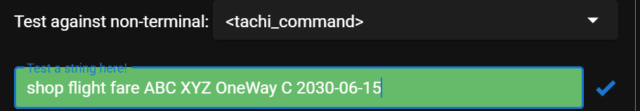
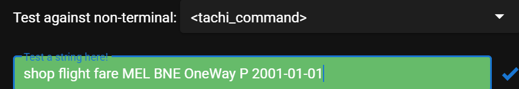

# Project Phase 2 Report

## Task 4.2 - Command grammer quality

This section documents the strategies, techniques, coverage criteria,
automation level, and improvements applied to grammar validation.

Our grammar is:

**Correct**
Compiles and runs in BNF Playground with no syntax errors, demonstrating structurally valid and internally consistent rules.

**Clear**
Uses consistent naming, a unified BNF/EBNF format, and structured comments, which improve readability and ease maintenance.

**Concise**
Removes redundant/overlapping rules, keeping only the minimal set needed for complete coverage and lower complexity.

### 4.2.1 High-level Strategies

#### Documentation and Annotation

- Used consistent naming for non-terminals (e.g. `<tachi_command>`),
  improving readability and avoiding ambiguity.
- Adopted a unified BNF/EBNF format to prevent inconsistencies.
- Added structured comments for better maintainability.

#### BNF Playground Validation

- Applied the Playground to write and test rules, using built-in “Grammar Help.”
- Validated incrementally so each rule was tested before integration.

#### Collaborative QA

- Used GitHub for team-wide QA.
- All grammar changes required PRs and peer review.
- CI/CD workflows automatically checked syntax and formatting.

### 4.2.2 Techniques

#### GitHub-based QA

- **Pull Request Review**: Each change reviewed by at least one teammate to
  ensure correctness and clarity.

  [View example PR on GitHub ](https://github.com/Nafisa42/2025S2-CITS5501-Group53-Project/pull/37)

- **CI Workflows**: Automated tests after commits verified parsing and
  formatting.
- **Traceability**: Git commits recorded all changes with rationale.

#### Grammar Testing and Validation

- **Fuzz Testing**: Playground’s random generator produced many test inputs,
  exposing ambiguities and edge cases.

    
    
  

- **Incremental Testing**: Simple rules tested first, then complex ones,
  reducing regressions.

  Taking `<air_book_request>` as an Example:

  #### shop_flight_fare - Minimum Legitimacy (OneWay)

  

  #### trip_type - two branches + boundary (Return + stay=0)

  

  #### length_of_stay - upper bound (20)

  

  #### airport - both must be legal (all uppercase 3 letters)

  

  #### date - boundary day/month (01/12, 01/31)

  

- **Rule Validation**: Each production rule validated individually,
  confirming internal consistency and absence of syntax errors.

  Taking `<air_book_request>` as an example:

  ##### **Legal**

  - Basic legal use case (single flight segment)  
    

  - Multiple valid use cases (recursive seg_list + flight number of different
    lengths)  
    

  - People boundary (maximum number of people 10)  
    

  ##### **Illegal**

  - The airline has two missing letters  
    

  - Number exceeds the limit (11)  
    

  - Lack of EOC (incomplete ending)  
    

### 4.2.3 Coverage Criteria

To guarantee completeness we applied:

#### Production Coverage (PDC)

Each rule tested at least once. For our grammar, PDC needs 11–12 commands:

#### shop_flight_fare

- `OneWay / Return` branches
- `length_of_stay` bounds (0, 20)
- `cabin` at least one valid cabin
- `date` at least one valid date
- `airport` at least twice

#### air_book_request

- `seg_list` single vs multi-line recursion
- `flight_number` lengths 1–4 digits
- `people` bounds (1, 10)
- `cabin` at least one valid
- `date` and `airport` at least once

_Reason_:PDC This approach avoids untested or unreachable rules while maintaining manageable test size.
It provides balanced coverage for nested and recursive structures (e.g., <seg_list>), ensuring the grammar remains functionally complete and semantically valid without exhaustive combinations.

#### Derivation Coverage (DC)

Selected derivation paths tested deeply to explore boundaries and detect
ambiguities.

#### shop flight fare command

- Branch × boundary (e.g., `Return` + stay=20 + edge date)
- Compare `OneWay` vs `Return`
- Date extremes (day 01 vs 31, month 01 vs 12)
- Negative cases (lowercase airports, invalid dates, extra spaces)

#### air book request command

- Multi-segment recursion × flight number lengths
- `people` = 10 in last segment
- Date extremes (day 01 vs 31, month 01 vs 12)
- Negative cases (lowercase, invalid dates, extra spaces)

_Reason_: It helps uncover ambiguities, overlapping rules, or semantic conflicts when valid rules are combined.

Together with PDC, it ensures both breadth (rule coverage) and depth (interaction coverage), improving overall robustness.

### 4.2.4 Degree of Automation

#### Automated Components

- Grammar parsing with Playground.
- Fuzz testing via random input generator.
- CI/CD pipelines validating each commit or PR.

#### Manual Components

- Comment/readability checks: clarity and conciseness reviewed manually.
- Naming conventions: verified against project rules.
- Peer review: essential to resolve ambiguities and ensure shared understanding.

### 4.2.5 Improvements

#### Comment and Readability Checks

- **Limitation**: Tools can’t judge clarity/readability.
- **Improvement**: Add **linters** + a **comment checklist** to flag missing/malformed comments.  
  Require 1–2 line annotations per production (e.g., explain `<seg_list>` recursion intent).

#### Naming Conventions

- **Limitation**: Enforced mainly by manual review.
- **Improvement**: Add CI rules to validate non-terminal style (e.g., `lower_snake_case`) and reserved prefixes.  
  Block PRs when names drift (e.g., `<TripType>` vs `<trip_type>`).

#### Peer Review

- **Limitation**: Time-consuming; easy to miss bulk changes.
- **Improvement**: Use **AI-assisted review** (Copilot/ChatGPT) and **visual diffs** to highlight edits to rules/regex.  
  Require side-by-side before/after for key productions (e.g., `<flight_number>`).

#### Configuration Consistency

- **Limitation**: Grammar doesn’t enforce runtime limits.
- **Improvement**: Add a **validation script** to cross-check ranges with config (e.g., `NUM_PEOPLE 1–10`, `LENGTH_OF_STAY 0–20`).  
  Fail CI if mismatches (e.g., grammar allows 0 but config min is 1).

## Task 5.1 – ShopFlightFareCommand constructor analysis

### Preconditions

- **Origin and Destination Codes**  
  Both parameters must be valid IATA airport codes: exactly three uppercase letters (e.g., `PER`, `SYD`) in IATA format.Violations will throw `SyntacticError`. Anything else that are good with form but not reall IATA airports or invalid are syntactically invalid and throw `SemanticError`.

- **Origin and Destination Uniqueness**  
  Origin and destination codes must not be the same. If they are equal, this is semantically invalid which throw `SemanticError`.

- **Trip Type**  
  Must be either `OneWay` or `Return`. These are the only two options defined in the command syntax.

- **Length of Stay (LOS)**  
  Required only when the trip type is `Return`. LOS must be an integer between 0 and 20 inclusive. If trip type is `OneWay`, LOS must be absent(NULL).

- **Cabin Type**  
  `cabinType` should be not null and must be one of the six permitted codes: `P`, `F`, `J`, `C`, `S`, or `Y`. These map to the `CabinType` enumeration in the specification and occurs **upstream'** in the command parser and not in the constructor.

- **Departure Date**  
  Must be in `YYYY-MM-DD` format. Semantically, it must represent a valid calendar date that is **not earlier than today** and **no more than 100 days in the future**. Dates before today, or beyond 100 days, will throw `SemanticError`.

- **Error Handling**  
  If inputs covers abnormal origin or destination codes (e.g., a 2-letter code), a `SyntacticError` should be raised. If inputs break meaning rules (e.g., a past date, origin=destination, or LOS out of range), a `SemanticError` should be raised.

### Postconditions

- **Valid Object Construction**  
  When all preconditions are satisfied, a `ShopFlightFareCommand` instance is created with consistent internal state:

  - Stores the origin and destination IATA codes which are three uppercase letters and not equal to each other.
  - Records trip type that are `ONE_WAY` or `RETURN`. For OneWay trips, LOS is absent(Null). For Return trips, a valid LOS (0–20) is stored.
  - Stores cabin type and is enum value.
  - Records departure date within the allowed window.

- **Exception on Violation**  
  If any precondition is violated, the constructor does not create an object. Instead, it throws an exception (`SyntacticError` if it is 
  a not allowed IATA codes or `SemanticError` other situation like same origin or destination).

### Justification

These preconditions and postconditions are taken directly from the
**Tachi command specification** for `shop flight fare` and the unit's error model(Syntacitic and semantic). They align with the unit’s error model, which distinguishes between syntactic and semantic errors.
The constructor must guarantee that any constructed object represents a valid, executable command. This ensures downstream components can safely assume the command’s parameters are correct without performing redundant checks.

---

## Task 5.2 – Input Space Partitioning

### Error Model (Fixture Assumptions)

- **SyntacticError** – raised when inputs break **format rules**. Examples:

  - Airport code not exactly three uppercase letters.
  - Flight number not matching a request format that assume we adopt `[A-Z]{2}\d{3,4}` as a *syntactic* format for flight numbers and 
  `Well-formed but unknown flight` is treated as `SemanticError`.
  - Cabin type parsing occurs upstream.

- **SemanticError** – raised when inputs are well-formed but violate business rules. Examples:
  - Origin = destination.
  - Passengers outside 1–10.
  - Date ≤ today or > today.
  - Flight number not existing (passes format but refers to no known service).
  - Length of Stay > 20.

**Fixture:** Inputs of type `LocalDate` are already guaranteed calendar-valid by upstream parsing. No string format errors for dates occur at this level.

---

### ISP Steps

The Input Space Partitioning (ISP) process followed here is:

1. Identify input objects (e.g., origin, destination, passengers, date, flight number, cabin type).
2. Define characteristics for each input object (format, range, uniqueness, etc.).
3. Derive partitions (valid vs invalid cases).
4. Select a coverage criterion (Base Choice Coverage).
5. Generate test cases from the chosen partitions.

---

### SegmentSubcommand Constructor – ISP Analysis

#### Coverage Level

For this analysis the **Base Choice Coverage** strategy was applied. This method selects one representative test from each input partition rather than attempting all possible combinations. Since the constructor has multiple parameters (origin,destination, number of passengers, date, flight number, and cabin type), full combinatorial testing would be infeasible. Base Choice provides a balanced approach: it keeps the test suite small while ensuring that every important input characteristic is exercised at least once, including boundary and error partitions.

#### Characteristics and Partitions

| Input Object         | Characteristic     | Partitions (Valid / Invalid)                        | Error Type     |
| -------------------- | ------------------ | --------------------------------------------------- | -------------- |
| Origin code          | Format legality    | 3-letter uppercase / wrong length or invalid chars  | SyntacticError |
| Destination code     | Relation to origin | Different from origin / same as origin              | SemanticError  |
| Number of passengers | Range              | 1–10 inclusive / <1 or >10                          | SemanticError  |
| Date (LocalDate)     | Time semantics     | > today                                             | SemanticError  |
| Flight number        | Syntax             | Wrong format                                        | SyntacticError |
|                      | Validity           | Well-formed but invalid flight number               | SemanticError  |
| Cabin type           | Parsed upstream    | already a `CabinType` enum at this level            | —              |

#### Justification

- **Origin code**

  - _Source_: Tachi spec requires IATA 3-letter uppercase codes.
  - _Method_: Functionality-based partitioning (valid vs invalid string format).
  - _Why chosen_: Airport code validity is foundational; if incorrect, no segment can be created.

- **Date**

  - _Source_: Business rule restricts travel date to after today.
  - _Method_: Boundary-value partitioning (today, <today, >today).
  - _Why chosen_: Dates are highly error-prone; boundaries often cause failures.

- **Passengers**
  - _Source_: System constraint of 1–10 passengers per booking.
  - _Method_: Range-based partitioning (valid range, underflow, overflow).
  - _Why chosen_: Passenger count limits are critical to prevent invalid or unrealistic requests.

Together, these ensure coverage of the most failure-prone characteristics, while the other features (destination, flight number, cabin type) are still captured in the table and tested.

#### Test Cases

| ID  | Variation           | Input (relative to base)                                                  | Expected Outcome |
| --- | ------------------- | --------------------------------------------------------------            | ---------------- |
| TC1 | Base                | ORIGIN=PER, DEST=SYD, NUM=1, DATE=tomorrow, FL=QF123, CABIN=EconomyClass  | Success          |
| TC2 | Invalid Origin      | ORIGIN=xx, DEST=SYD, NUM=1, DATE=tomorrow, FL=QF123, CABIN=EconomyClass   | SyntacticError   |
| TC3 | Too Many Passengers | ORIGIN=PER, DEST=SYD, NUM=20, DATE=tomorrow, FL=QF123, CABIN=EconomyClass | SemanticError    |
| TC4 | Date = today        | ORIGIN=PER, DEST=SYD, NUM=1, DATE=today, FL=QF123, CABIN=EconomyClass     | SemanticError    |

Each characteristic’s invalid partition is exercised at least once, while keeping tests simple and
non-overlapping.

---

### Additional Constructor – ShopFlightFareCommand

#### Coverage Level

The same **Base Choice Coverage** strategy was used. The constructor has multiple parameters (origin, destination, trip type, length of stay, date, and cabin type). A full combinatorial approach would be excessive, so Base Choice ensures each important characteristic is tested at least once.

#### Characteristics and Partitions

| Input Object   | Characteristic      | Partitions (Valid / Invalid)                       | Error Type     |
| -------------- | ------------------- | -------------------------------------------------- | -------------- |
| Trip type      | Allowed values      | OneWay, Return / anything else                     | SyntacticError |
| Length of Stay | Conditional rule    | if OneWay, lengthOfStay must be null               | SemanticError  |
|                |                     | if Return 0–20 / absent or >20                     | SemanticError  |
| Departure date | Time semantics      | > today/ today, <today                             | SemanticError  |
| Cabin type     | Parsed upstream     | already a `CabinType` enum at this level           | —              |

#### Justification

These characteristics were chosen because they reflect the main business rules governing flight fare searches. The trip type (OneWay or Return) is central to the command’s behaviour, while the length of stay only applies when a return trip is requested. The departure date is bounded to avoid expired or unrealistic queries, and the cabin type ensures class codes conform to airline conventions. Testing these partitions ensures that the constructor either produces a valid command or fails with the correct exception.

#### Test Cases

| ID   | Input                                                                        | Expected Outcome |
| ---- | -----------------------------------------------------------------            | ---------------- |
| SFC1 | ORIGIN=PER, DEST=SYD, TRIP=OneWay, DATE=tomorrow, CABIN=EconomyClass         | Success          |
| SFC2 | ORIGIN=PER, DEST=SYD, TRIP=Return, LOS=25, DATE=tomorrow, CABIN=EconomyClass | SemanticError    |
| SFC3 | ORIGIN=PER, DEST=SYD, TRIP=OneWay, DATE=today, CABIN=EconomyClass            | SemanticError    |

This minimal ISP set ensures that both syntactic and semantic invalids are exercised for `ShopFlightFareCommand`.
